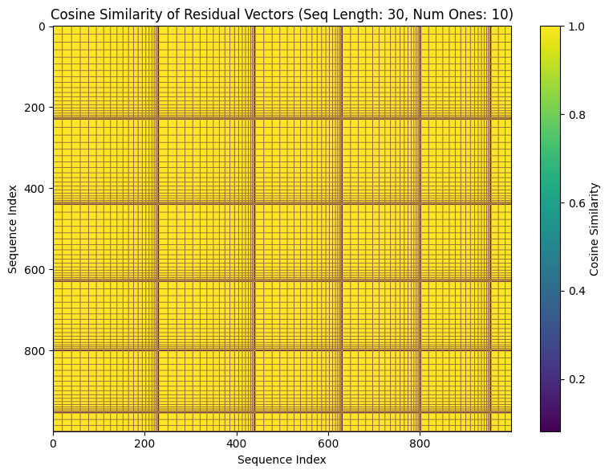
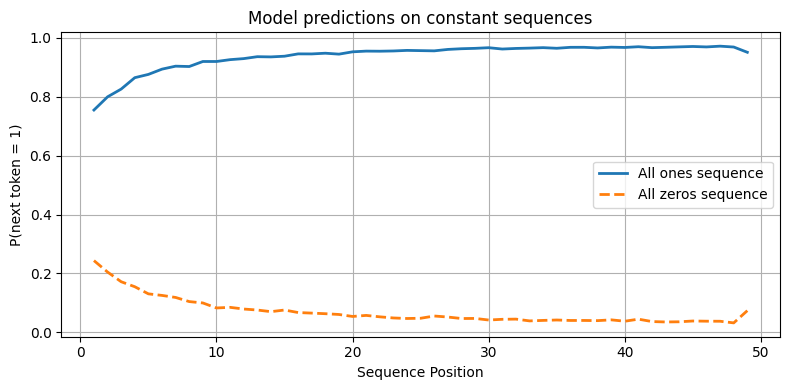
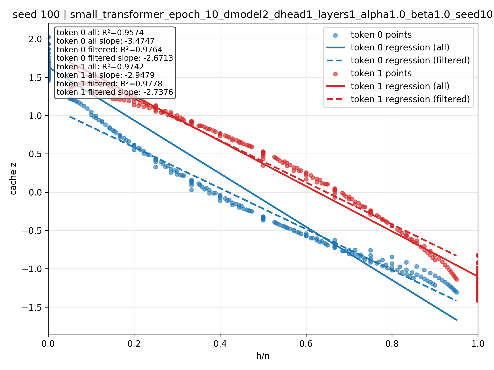

# Study of Beta-Bernoulli Transformers

> **Note: work in progress! Code is really messy, if I were to do this again I would do it differently.**


## Research Overview

- We study how a transformer performs Bayesian updating by training on beta-bernoulli tasks.
- Coin probabilities are sampled from a beta prior, and the model performs next token (coinflip) prediction. 
- We train a transformer with d_vocab = 2 (or 3, if we include the BOS token). 

The optimal solution the transformer has to implement is 

$$p(\text{next coin} = 1 | \text{observations}) = \frac{H + \alpha}{N + \alpha + \beta}$$

- The optimal solution is determined by the sufficient statistics of the data $(H,N)$. One question we asked was if we could probe for the model storing the sufficient statistics somehow. 
- We were also interested in 1. whether model predictions are permutation invariant for sequences with the same number of 1s, and 2. whether model predictions are symmetric for flipped sequences. 
- Models trained using transformerlens, see `core/models.py`.
- To ease mechanistic studies, we bottleneck the model's dimensionality (attention head dimension 1, residual dimension 2, mlp dimension 16), and play around with fixing the positional embeddings.


### (Preliminary) Results

- We find that the transformer manages to implement permutation invariance very well, though we note that the final observation in the sequence (that is, the current token) plays a special role in the residual vector. This makes sense as the embedding of the current token is the input to the residual stream.



- Predictions are not exactly symmetric (note: in theory we can get perfect symmetry by taking the negative of the post_mlp residual before unembedding) 



- In the case where d_head = 1, we find that the attention coefficient is nearly linear with respect to $\frac{H}{N}$.




## 📁 Project Structure

```
├── core/                       # Core model implementations and utilities
│   ├── config.py               # Model and training configurations
│   ├── models.py               # Transformer model implementations
│   ├── training.py             # Training loop and utilities
│   ├── samplers.py             # Data sampling and task generation
│   ├── plotting.py             # Visualization utilities
│   └── utils.py                # General utility functions
├── experiments/                # Research experiments and analysis
│   ├── exp_*.py                # Individual experiments
│   └── saved_models/           # Saved model checkpoints
├── figures/                    # Generated plots and visualizations
├── results/                    # Experiment results organized by type
├── archive/                    # Archived experiments and old code
├── html/                       # HTML output files
```


### Running Experiments

Experiments are designed to run as notebook-style scripts using `#%%` separators in VSCode.
